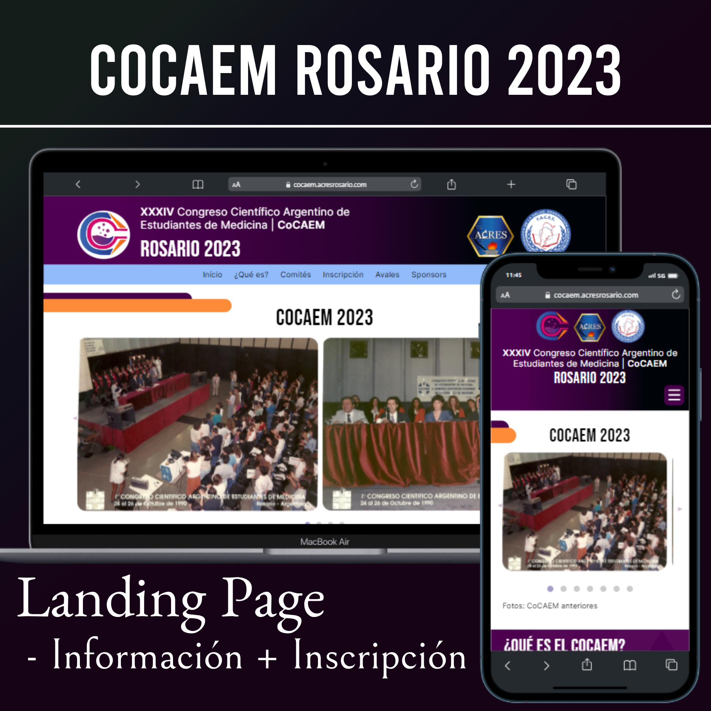

# CoCAEM2023

This is a real webpage that I made for a Argentine Scientific Congress for Medicine Students.

 

<h2>Project Preview</h2>

 

<h2>📚 Technologies:</h2>
<ul>
  <li>Figma</li>
  <li>HTML5</li>
  <li>CSS3</li>
  <li>JavaScript</li>
</ul>

<h2>💻 Project:</h2>

This is a landing page that aims to give information about the event for University Medicine Students from Argentina, called CoCAEM (Argentine Scientific Congress of Medical Students).

In this project I use my knowledge about webpack, a static module bundler for JavaScript applications. That make your application usable in a web browser.

